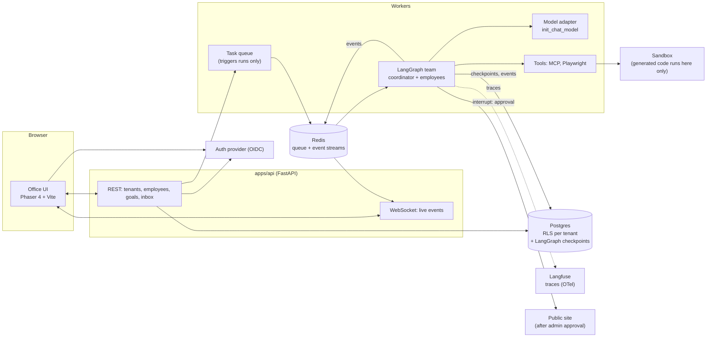

# Staffroom

Hire AI employees, give them a goal in plain language, and watch them build and ship a website from a pixel-art virtual office.

Staffroom is a multi-tenant SaaS. A tenant admin (a non-technical founder) hires AI employees from a catalog of skills (React, Node.js, AI integration, ...). Each employee is an agent with a merged skill set. The admin states a goal such as *"build me an LLM wrapper website"*. A platform-provided coordinator plans and assigns the work, the employees work autonomously (also while the admin is logged out), and the result is a deployed public website, published only after the admin approves. When an agent is blocked, for example because it needs an API key, it appears as a plain-language item in the admin's inbox.

> Open-source portfolio project. Synthetic data only.

## Architecture

Target architecture. See [Status](#status) for what exists today.



## Status

Honest status. **Real** = implemented and tested. **Stubbed** = placeholder. **Planned** = not started.

| Area | Status | Notes |
|---|---|---|
| Repo, CI, compose (Postgres, Redis, Langfuse) | Real | CI runs lint/format/secret scan only; tests arrive with M0 code |
| Framework spikes (M-1) | Real | [docs/frameworks/](docs/frameworks/) |
| FastAPI app + `/health` in compose (M0) | Real | Checks Postgres and Redis; tested in CI |
| Alembic migrations, tenants + employees with RLS (M0) | Real | Isolation proven by tests against real Postgres ([ADR-0005](docs/adr/0005-tenant-isolation-with-postgres-rls.md)) |
| Skill catalog, hire/list employees API (M1) | Real | Tested over HTTP against Postgres with RLS; tenants created on first sign-in |
| Team builder + `POST /goals` (M1) | Real, **fake model** | Coordinator + skill pools (ADR-0007); no real LLM yet |
| Runs + event log (M1) | Real | `POST /goals` returns 202; events stored per tenant with RLS |
| Background worker (M1) | Real | Taskiq on Redis Streams ([ADR-0004](docs/adr/0004-task-queue-taskiq.md)) |
| Resume after worker crash (M1) | Real | Resumes from the LangGraph Postgres checkpoint without redoing finished tasks (tested + demoed with `kill -9`). Includes a workaround for a taskiq-redis reclaim bug ([ADR-0004](docs/adr/0004-task-queue-taskiq.md)) |
| Live event stream (M1) | Real | WebSocket `/runs/{id}/stream`: replay + live via Redis Streams, Postgres fallback |
| Identity provider: Keycloak with organizations (M0) | Real | Realm as code ([ADR-0003](docs/adr/0003-auth-keycloak.md)); demo founders for Acme and Globex |
| API token verification | Real | PyJWT against Keycloak's JWKS; tenant = the token's organization; WebSocket token via subprotocol (never in URLs or logs) |
| Agent core: skills, team builder, events (M1) | Planned | |
| Sandbox: hardened Docker per run (M2) | Real, **dev/CI grade** | deepagents backend protocol ([ADR-0006](docs/adr/0006-sandbox-deepagents-backends.md)); worker reaches Docker only via a socket proxy; E2B planned for production |
| Agent file + execute tools (M2) | Real | deepagents `FilesystemMiddleware`; one workspace volume per run, kept after the run |
| Browser tools: Playwright MCP in the sandbox (M2) | Real | Employees with the Testing skill check the built site in Chromium; langchain-mcp-adapters over `docker exec` stdio; curated tool set |
| Office UI (M3) | Real | Phaser 4 + Vite, Tiled map; Keycloak sign-in (oidc-client-ts, PKCE); start a goal, watch employees walk to the huddle, work and finish live (WebSocket). Placeholder art, straight-line walking (no pathfinding yet) |
| Tracing: Langfuse (M4) | Real | One trace per run (session = run, user = tenant), every model/tool call nested; secrets masked before export ([ADR-0008](docs/adr/0008-observability-langfuse.md)). Needs `--profile observability` |
| Real model end-to-end run (M4) | Planned | |
| Durability across restarts / logout (M5) | Planned | |
| Admin inbox (M6.1) | Real | Employees ask via `ask_admin` (LangGraph interrupt); run waits without holding a worker; answer in the office to resume |
| Secret store (M6.2) | Real, **dev mode** | OpenBao ([ADR-0009](docs/adr/0009-secret-store-openbao.md)); credentials entered in the inbox go to OpenBao only, agents get the name; sandbox commands get them as env vars, values masked in output |
| Deploy with admin approval (M6.3) | Real, **local host** | `deploy_site` → private preview → Approve/Reject in the office → published at `http://localhost:8090/sites/<company>/` (Caddy). Previews protected by unguessable URL only; AWS publishing later |
| Research harness (M7) | Planned | |

Plan and progress: [docs/plans/](docs/plans/). Decisions: [docs/adr/](docs/adr/). Framework findings: [docs/frameworks/](docs/frameworks/).

## Run locally (5 minutes)

Prerequisites: Docker, [uv](https://docs.astral.sh/uv/getting-started/installation/), Node 22+.

```bash
git clone https://github.com/Ashma-Rai-32/orchestrator.git staffroom && cd staffroom
cp .env.example .env
uv sync
docker compose up -d --build --wait               # API + Postgres + Redis
curl http://localhost:8000/health                 # {"status":"ok",...}; API docs at /docs
docker compose --profile observability up -d      # optional: Langfuse at http://localhost:3000
uv run pytest apps/api                            # tests (need Postgres + Redis running)
```

Try it as a demo founder (tokens come from Keycloak; the `staffroom-dev-cli` password login is **dev only**):

```bash
TOKEN=$(curl -s localhost:8080/realms/staffroom/protocol/openid-connect/token \
  -d grant_type=password -d client_id=staffroom-dev-cli -d scope="openid organization" \
  -d username=founder@acme.test -d password=staffroom-dev | jq -r .access_token)
curl -s localhost:8000/me -H "Authorization: Bearer $TOKEN"
curl -s -X POST localhost:8000/employees -H "Authorization: Bearer $TOKEN" -H 'content-type: application/json' \
  -d '{"name":"Robin","skills":["react","css"]}'

# sign in, hire a small team, start a goal, and print its events live over the WebSocket
uv run scripts/watch_run.py "Build me an LLM wrapper website"
uv run scripts/watch_run.py --as founder@globex.test "Build a landing page"
```

Keycloak (identity): http://localhost:8080 (admin console: `admin` / `admin`). Demo founders: `founder@acme.test` and `founder@globex.test`, password `staffroom-dev`.

Langfuse login with the dev defaults from `.env.example`: `admin@staffroom.local` / `staffroom-dev`.

Office UI: `cd apps/office && npm install && npm run dev`, open http://localhost:5173 and sign in as `founder@acme.test` / `staffroom-dev` (email first, then password).

## Stack

Python 3.12+, uv, FastAPI, Pydantic v2, SQLAlchemy 2, Alembic, Postgres, Redis · LangGraph, LangChain · Langfuse, OpenTelemetry · Playwright · TypeScript, Vite, Phaser 4 · Docker Compose, Terraform, GitHub Actions · ruff, mypy, pytest, pre-commit.

## License

[MIT](LICENSE)
