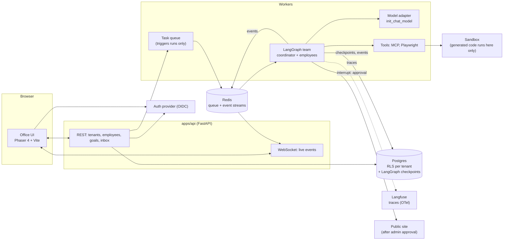

# Staffroom

Hire AI employees, give them a goal in plain language, and watch them build and ship a website from a pixel-art virtual office.

Staffroom is a multi-tenant SaaS. A tenant admin (a non-technical founder) hires AI employees from a catalog of skills (React, Node.js, AI integration, ...). Each employee is an agent with a merged skill set. The admin states a goal such as *"build me an LLM wrapper website"*. A platform-provided coordinator plans and assigns the work, the employees work autonomously (also while the admin is logged out), and the result is a deployed public website, published only after the admin approves. When an agent is blocked, for example because it needs an API key, it appears as a plain-language item in the admin's inbox.

> Open-source portfolio project. Synthetic data only.

## Architecture

Target architecture. See [Status](#status) for what exists today.



## Status

Honest status. **Real** = implemented and tested. **Stubbed** = placeholder. **Planned** = not started.

| Area | Status | Notes |
|---|---|---|
| Repo, CI, compose (Postgres, Redis, Langfuse) | Real | CI runs lint/format/secret scan only; tests arrive with M0 code |
| Framework spikes (M-1) | Real | [docs/frameworks/](docs/frameworks/) |
| FastAPI app + `/health` in compose (M0) | Real | Checks Postgres and Redis; tested in CI |
| Alembic migrations, tenants + employees with RLS (M0) | Real | Isolation proven by tests against real Postgres ([ADR-0005](docs/adr/0005-tenant-isolation-with-postgres-rls.md)) |
| Skill catalog, tenants, hire/list employees API (M1) | Real | Tested over HTTP against Postgres with RLS |
| Auth (M0) | **Stubbed** | Tenant comes from an `X-Tenant-ID` header; do not expose publicly |
| Agent core: skills, team builder, events (M1) | Planned | |
| Sandbox and tools (M2) | Planned | |
| Office UI (M3) | Planned | |
| Real model end-to-end run (M4) | Planned | |
| Durability across restarts / logout (M5) | Planned | |
| Deploy with admin approval (M6) | Planned | |
| Research harness (M7) | Planned | |

Plan and progress: [docs/plans/](docs/plans/). Decisions: [docs/adr/](docs/adr/). Framework findings: [docs/frameworks/](docs/frameworks/).

## Run locally (5 minutes)

Prerequisites: Docker, [uv](https://docs.astral.sh/uv/getting-started/installation/), Node 22+.

```bash
git clone https://github.com/Ashma-Rai-32/orchestrator.git staffroom && cd staffroom
cp .env.example .env
uv sync
docker compose up -d --build --wait               # API + Postgres + Redis
curl http://localhost:8000/health                 # {"status":"ok",...}; API docs at /docs
docker compose --profile observability up -d      # optional: Langfuse at http://localhost:3000
uv run pytest apps/api                            # tests (need Postgres + Redis running)
```

Try it (the `X-Tenant-ID` header is a **dev-only stub** until auth lands):

```bash
T=$(curl -s -X POST localhost:8000/tenants -H 'content-type: application/json' -d '{"name":"Demo Co"}' | jq -r .id)
curl -s localhost:8000/skills | jq '.[].key'
curl -s -X POST localhost:8000/employees -H "X-Tenant-ID: $T" -H 'content-type: application/json' \
  -d '{"name":"Robin","skills":["react","css"]}'
curl -s localhost:8000/employees -H "X-Tenant-ID: $T"
```

Langfuse login with the dev defaults from `.env.example`: `admin@staffroom.local` / `staffroom-dev`.

The office UI is not built yet. This section grows with each milestone.

## Stack

Python 3.12+, uv, FastAPI, Pydantic v2, SQLAlchemy 2, Alembic, Postgres, Redis · LangGraph, LangChain · Langfuse, OpenTelemetry · Playwright · TypeScript, Vite, Phaser 4 · Docker Compose, Terraform, GitHub Actions · ruff, mypy, pytest, pre-commit.

## License

[MIT](LICENSE)
